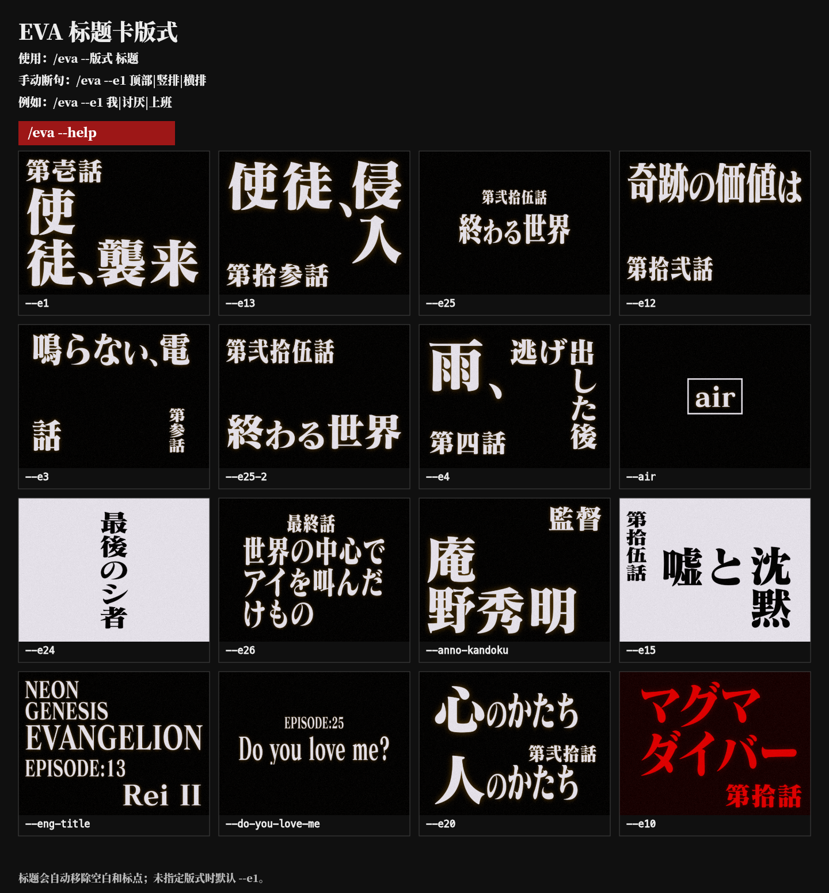

# EVA 标题卡生成器

**无需浏览器的 EVA 标题卡生成器，可作为 Hermes Skill 或独立 Node.js CLI 使用。16 种上游原版布局全部通过本地 Canvas/Skia 渲染，不需要 Chrome、Playwright、网页服务或远程字体代理。**

[English](README.md) · **简体中文**



## 为什么使用这个版本？

优秀的上游项目 [`itorr/eva-title`](https://github.com/itorr/eva-title) 基于浏览器运行。本项目保留其原始 `layouts.js` 与 `make.js` 几何逻辑，同时增加：

- 基于 `@napi-rs/canvas` / Skia 的本地原生渲染
- 16 种上游布局及其坐标、缩放、阴影、颜色与噪点
- 输出确定性 640×480 PNG 的独立 Node.js CLI
- 支持断句、布局选择和可视化帮助图的 Hermes `/eva` 命令
- 完全不依赖浏览器和网页服务的渲染路径

<p align="center">
  
</p>

## 环境要求

| 要求 | 说明 |
|---|---|
| macOS | 当前字体发现逻辑面向 macOS 用户字体目录 |
| Node.js | 建议 Node 18 或更新版本 |
| Matisse 字体 | 用户需自行持有合法授权的 `FOT-Matisse Pro EB.otf`；本仓库不分发 |
| 思源宋体 Heavy | 为 Matisse 缺字提供开源回退字形 |
| Hermes | 可选；渲染器也能作为独立 Node CLI 使用 |

将字体安装到 `~/Library/Fonts/`，或通过 `--font` 指向另一个兼容字体文件。字体缺失时程序会明确失败，不会静默换成不同视觉风格。

## 独立 Node.js CLI

```bash
git clone https://github.com/jas0nh/eva-title-skill.git
cd eva-title-skill/skills/eva
npm ci
node scripts/render-eva-title.mjs \
  --layout e24 \
  --texts '["测试"]' \
  --output /tmp/eva-title.png
```

## 安装为 Hermes Skill

```bash
hermes skills install jas0nh/eva-title-skill/skills/eva --category self-built
cd ~/.hermes/skills/self-built/eva
npm ci --omit=dev
node scripts/eva-command.mjs --command '--help' --output-dir /tmp/eva-output
```

随后可以使用：

```text
/eva --help
/eva --e24 测试
/eva --e1 顶部|竖排|横排
```

## 测试

进入 `skills/eva/` 后运行：

```bash
npm test
```

## 归属与许可证

版式实现、Canvas 绘制函数、简繁映射和 Matisse 字形清单来自 [`itorr/eva-title`](https://github.com/itorr/eva-title)，适用其 MIT License，详见 [`third_party/eva-title-MIT-LICENSE`](third_party/eva-title-MIT-LICENSE)。思源宋体适用 Adobe 的开源许可证。本仓库不得提交或分发本机商业字体文件。

这是非官方的同人开发工具，与《新世纪福音战士》相关权利方不存在隶属或授权关系。

本仓库原创的封装代码采用 [MIT License](LICENSE)。
